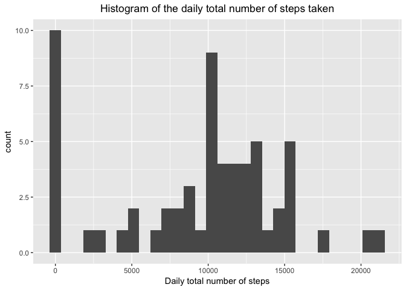
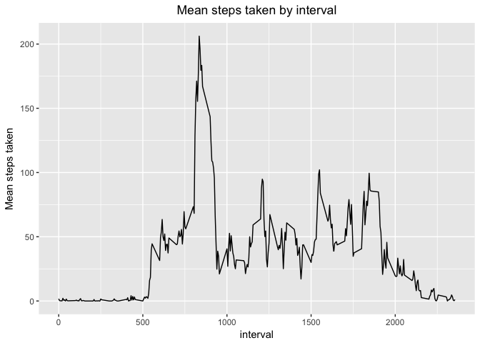
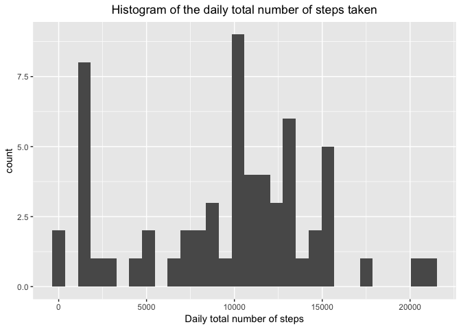
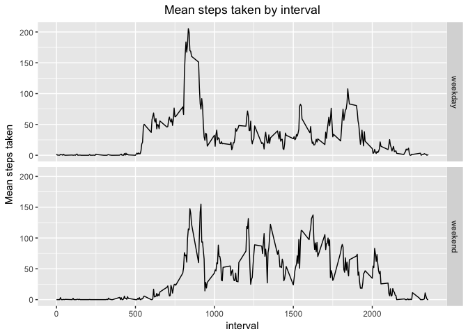

# Loading and preprocessing the data


```r
# Read in data and store in df data frame
df <- read.csv('activity.csv', stringsAsFactors = F)

# Convert data column to data format
df$date <- as.Date(df$date)
```

# What is the mean total number of steps taken per day?


```r
# Load packages
library(dplyr)
```

```
## 
## Attaching package: 'dplyr'
```

```
## The following objects are masked from 'package:stats':
## 
##     filter, lag
```

```
## The following objects are masked from 'package:base':
## 
##     intersect, setdiff, setequal, union
```

```r
library(ggplot2)

# Calculate total number of steps by date
totalNumSteps <- df %>% group_by(date) %>%
                        summarise(total_num_steps = sum(steps, na.rm = T))

# Create histogram of daily total number of steps taken
totalNumSteps %>% ggplot() + geom_histogram(aes(x=total_num_steps)) + xlab('Daily total number of steps') + ggtitle('Histogram of the daily total number of steps taken') + theme(plot.title = element_text(hjust=0.5))
```

```
## `stat_bin()` using `bins = 30`. Pick better value with `binwidth`.
```

<!-- -->

```r
# Calculate and print mean and median of daily total number of steps
mean(totalNumSteps$total_num_steps)
```

```
## [1] 9354.23
```

```r
median(totalNumSteps$total_num_steps)
```

```
## [1] 10395
```

# What is the average daily activity pattern?


```r
# Create time series graph of mean steps taken with respect to interval
df %>% group_by(interval) %>%
       summarise(mean_steps_taken=mean(steps, na.rm = T)) %>%
       ggplot() + geom_line(aes(x=interval, y=mean_steps_taken)) + ylab('Mean steps taken') + ggtitle('Mean steps taken by interval') + theme(plot.title = element_text(hjust=0.5))
```

<!-- -->

```r
# 835 interval has maximum mean steps of 206
```

# Imputing missing values


```r
# Number of NAs in dataset
sum(is.na(df$steps))
```

```
## [1] 2304
```

```r
# Impute missing values with median for that 5 minute interval
df_imputed <- df %>% group_by(interval) %>%
                     mutate(median_steps_for_interval=median(steps, na.rm = T)) %>%
                     ungroup() %>%
                     mutate(steps=ifelse(is.na(steps), median_steps_for_interval, steps))

# Remove median_steps_for_interval column
df_imputed$median_steps_for_interval <- NULL

# Calculate total number of steps by date using imputed dataset
totalNumStepsImputed <- df_imputed %>% group_by(date) %>%
                        summarise(total_num_steps = sum(steps))

# Create histogram of daily total number of steps taken using imputed dataset
totalNumStepsImputed %>% ggplot() + geom_histogram(aes(x=total_num_steps)) + xlab('Daily total number of steps') + ggtitle('Histogram of the daily total number of steps taken') + theme(plot.title = element_text(hjust=0.5))
```

```
## `stat_bin()` using `bins = 30`. Pick better value with `binwidth`.
```

<!-- -->

```r
# Calculate and print mean and median of daily total number of steps using imputed dataset
mean(totalNumStepsImputed$total_num_steps)
```

```
## [1] 9503.869
```

```r
median(totalNumStepsImputed$total_num_steps)
```

```
## [1] 10395
```

```r
# With imputed data, the mean number of steps taken daily increases vs non-imputed data. However median number of steps taken daily remains the same. For the imputed dataset, there is a much smaller number of zero daily steps taken (see histograms), since the non-imputed data removes NAs when calculating the total number of daily steps taken, so more are calculated as zero for the non-imputed dataset.
```

# Are there differences in activity patterns between weekdays and weekends?


```r
# Create factor column which dictates whether date fell in weekday or weekend
df_imputed$weekday_or_weekend <- factor(ifelse(weekdays(df_imputed$date) %in% c('Saturday', 'Sunday'), 'weekend', 'weekday'),
                                        levels=c('weekday', 'weekend'))

# Create time series graph of mean steps taken with respect to interval, facetted by weekday/weekend dates
df_imputed %>% group_by(weekday_or_weekend, interval) %>%
               summarise(mean_steps_taken=mean(steps, na.rm = T)) %>%
               ggplot() + geom_line(aes(x=interval, y=mean_steps_taken)) + facet_grid(weekday_or_weekend ~ .) + ylab('Mean steps taken') + ggtitle('Mean steps taken by interval') + theme(plot.title = element_text(hjust=0.5))
```

<!-- -->
